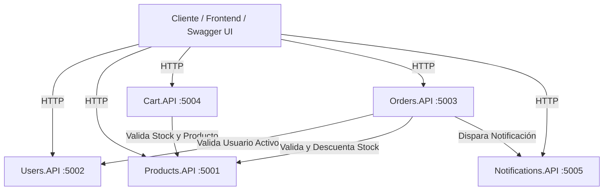
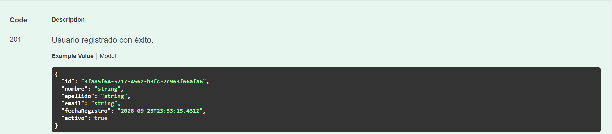
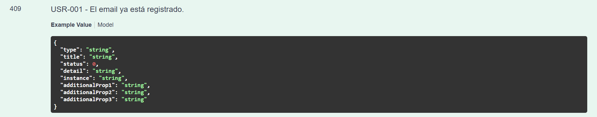
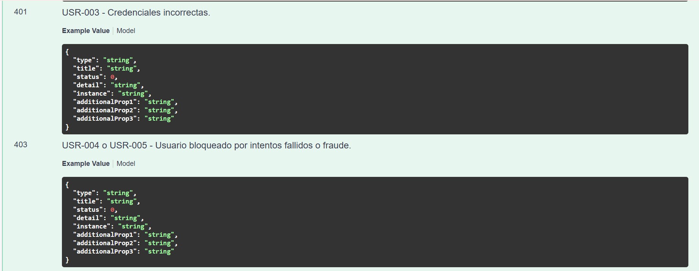

# 🛒 Sistema de E-Commerce - Microservicios .NET Core

Trabajo Práctico para la materia **Arquitectura y Diseño de Software**.
Desarrollo de una plataforma de comercio electrónico modular basada en microservicios REST con **C# y .NET Core 10**, documentada con **Swagger / OpenAPI**, con logs estructurados en **Serilog**, trazabilidad mediante **Correlation ID** y manejo global de errores con **IExceptionHandler**.

---

## 👥 Integrantes del Grupo 8
- **Franco Martin Eusebio** (`Users.API`)
- *Integrante 2*
- *Integrante 3*

---

## 🏗️ Arquitectura General del Sistema

El sistema está dividido en **5 microservicios independientes**, cada uno con su propia base de datos o almacenamiento, puerto de red y responsabilidad única:



---

## 🌐 Tabla de Puertos y Servicios

| Microservicio | Puerto HTTP | Swagger UI | Estado |
| :--- | :---: | :--- | :---: |
| **`Users.API`** | `5002` | [http://localhost:5002/swagger](http://localhost:5002/swagger) | ✅ Completado |
| **`Products.API`** | `5001` | `http://localhost:5001/swagger` | ⏳ Pendiente |
| **`Orders.API`** | `5003` | `http://localhost:5003/swagger` | ⏳ Pendiente |
| **`Cart.API`** | `5004` | `http://localhost:5004/swagger` | ⏳ Pendiente |
| **`Notifications.API`** | `5005` | `http://localhost:5005/swagger` | ⏳ Pendiente |

---

## 👤 Microservicio `Users.API` (Guía Explicativa Detallada)

> 💡 **¿Qué es este servicio para alguien que no sabe de programación?**  
> Imagina que `Users.API` es la **oficina de recepción y seguridad** de una tienda online.  
> 1. Cuando una persona nueva quiere comprar, va a la recepción a registrarse con su nombre, correo y una contraseña segura.
> 2. La recepción guarda la contraseña bajo una caja fuerte codificada (hashing con BCrypt) para que **nadie** pueda ver la clave real.
> 3. Cuando el cliente vuelve a ingresar (login), la recepción valida que el correo y la contraseña coincidan.
> 4. Si una persona intenta adivinar una contraseña y **se equivoca 3 veces seguidas**, la recepción bloquea la cuenta de inmediato por seguridad para proteger al dueño.

---

### 📋 Funcionalidades y Endpoints de `Users.API`

#### 1. Registro de Usuario (`POST /api/users/register`)
- **Qué hace:** Crea un nuevo usuario en el sistema.
- **Campos necesarios:** Nombre, Apellido, Email y Contraseña (mínimo 6 caracteres).
- **Seguridad:** Encripta la contraseña usando el algoritmo `BCrypt`.
- **Códigos de respuesta:**
  - `201 Created`: Usuario registrado con éxito. Devuelve su identificador único (ID).
  - `400 Bad Request`: Faltan datos obligatorios o el formato del email no es válido (`USR-002`).
  - `409 Conflict`: Ya existe otra persona registrada con ese mismo correo (`USR-001`).

#### 2. Inicio de Sesión / Login (`POST /api/users/login`)
- **Qué hace:** Verifica que el usuario y la contraseña sean correctos.
- **Regla de Bloqueo por Seguridad:**
  - Si ingresa mal la contraseña: suma 1 intento fallido (`401 Unauthorized - USR-003`).
  - Si acumula **3 intentos fallidos consecutivos**: la cuenta se bloquea automáticamente (`403 Forbidden - USR-004`).
  - Si ingresa la contraseña correcta: el contador de intentos fallidos se reinicia a 0 (`200 OK`).
- **Seguridad:** El campo `passwordHash` **nunca** se envía en la respuesta para evitar filtraciones.

#### 3. Consultar Usuario por ID (`GET /api/users/{id}`)
- **Qué hace:** Permite que otros microservicios (como `Orders.API`) consulten si un usuario existe y si su cuenta está activa antes de permitirle hacer una compra.
- **Códigos de respuesta:**
  - `200 OK`: Devuelve los datos del usuario.
  - `404 Not Found`: No existe ningún usuario con ese ID (`USR-007`).

#### 4. Listar Usuarios (`GET /api/users`)
- **Qué hace:** Devuelve el listado de todos los usuarios registrados.

---

### 🚨 Catálogo de Errores de `Users.API`

Todas las respuestas de error siguen el estándar internacional **RFC 7231 Problem Details**, garantizando que el usuario o frontend reciba un mensaje claro con un código propio:

| Código | Código HTTP | Mensaje de Error | Motivo / Cuándo ocurre |
| :---: | :---: | :--- | :--- |
| **`USR-001`** | `409 Conflict` | *El email '{email}' ya está registrado.* | Se intenta registrar un email que ya existe en la base. |
| **`USR-002`** | `400 Bad Request` | *Los datos del usuario son inválidos.* | Faltan campos obligatorios o el email no tiene formato correcto. |
| **`USR-003`** | `401 Unauthorized` | *Credenciales incorrectas.* | El correo o la contraseña no coinciden. |
| **`USR-004`** | `403 Forbidden` | *Su cuenta fue bloqueada por superar el máximo de intentos fallidos.* | Se alcanzaron 3 o más intentos fallidos seguidos. |
| **`USR-005`** | `403 Forbidden` | *Su cuenta fue suspendida por razones de seguridad.* | Usuario bloqueado por sospecha de fraude. |
| **`USR-006`** | `500 Internal Server Error` | *Error interno al procesar el usuario.* | Error no controlado en el servidor o caída del sistema. |
| **`USR-007`** | `404 Not Found` | *Usuario con ID '{id}' no encontrado.* | Se busca un ID inexistente. |

---

## 📸 Evidencias de Funcionamiento (Swagger UI)

A continuación se adjuntan las capturas de pantalla de las pruebas realizadas sobre el microservicio `Users.API` desde la interfaz de Swagger:

### 1. Registro Exitoso de un Usuario (`201 Created`)
Se envía la información del nuevo usuario y el sistema responde confirmando la creación con su respectivo identificador GUID generado.



---

### 2. Error por Email Duplicado (`409 Conflict - USR-001`)
Al intentar registrar nuevamente un usuario con el mismo email, el sistema rechaza la solicitud devolviendo el formato estructurado con el código de error `USR-001`.



---

### 3. Errores de Autenticación y Bloqueo de Cuenta (`401 USR-003` / `403 USR-004`)
Prueba de credenciales erróneas (`USR-003`) y la activación automática del bloqueo de seguridad al tercer intento fallido (`USR-004`).



---

## 🚀 Cómo Ejecutar el Proyecto Paso a Paso

### 1. Requisitos Previos
- Tener instalado [.NET SDK 10.0](https://dotnet.microsoft.com/download/dotnet/10.0).

### 2. Clonar el Repositorio
```powershell
git clone https://github.com/rodriips/TP-Microservicios-ECommerce-Grupo8.git
cd TP-Microservicios-ECommerce-Grupo8
```

### 3. Compilar la Solución
```powershell
dotnet build
```

### 4. Levantar `Users.API`
```powershell
dotnet run --project src/Users.API/Users.API.csproj
```

### 5. Abrir Swagger en el Navegador
Abre tu navegador de preferencia e ingresa a:
👉 **[http://localhost:5002/swagger](http://localhost:5002/swagger)**

### 6. Health Checks (Monitoreo de Salud del Servicio)
- Estado general: [http://localhost:5002/health](http://localhost:5002/health)
- Listo para recibir tráfico: [http://localhost:5002/health/ready](http://localhost:5002/health/ready)
- Servicio vivo: [http://localhost:5002/health/live](http://localhost:5002/health/live)

---

## 📂 Estructura del Código de `Users.API`

```
src/Users.API/
├── Controllers/
│   └── UsersController.cs         # Recibe los pedidos HTTP y responde al cliente
├── Models/
│   └── User.cs                    # Entidad principal de datos del usuario
├── DTOs/
│   └── UserDTOs.cs                # Modelos de entrada y salida de datos validados
├── Services/
│   ├── IUserService.cs            # Contrato de negocio
│   └── UserService.cs             # Lógica de login, registro, hashing y bloqueo
├── Exceptions/
│   └── DomainExceptions.cs        # Excepciones personalizadas (NotFound, Conflict, etc.)
├── ExceptionHandlers/
│   └── ExceptionHandlers.cs       # Convierte excepciones en respuestas ProblemDetails
├── Common/
│   └── ErrorCodes.cs              # Constantes de códigos de error (USR-001 a USR-007)
├── logs/                          # Archivos diarios de logs generados por Serilog
├── appsettings.json               # Configuración de niveles de log
└── Program.cs                     # Inicialización de Serilog, Swagger y middlewares
```
