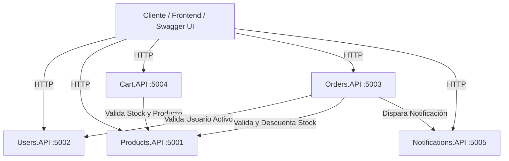
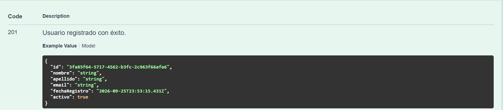
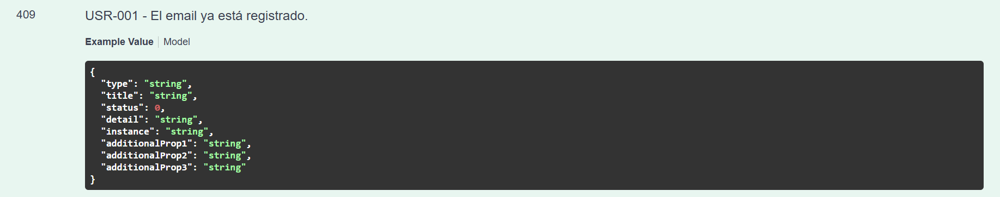
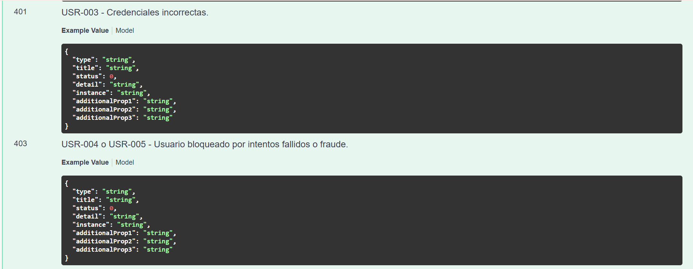

# 🛒 Sistema de E-Commerce - Microservicios .NET Core

Trabajo Práctico **Arquitectura y Diseño de Software**.  
Desarrollo de una plataforma de comercio electrónico modular basada en microservicios REST con **C# y .NET Core 10**, documentada con **Swagger / OpenAPI**, con logs estructurados en **Serilog**, trazabilidad mediante **Correlation ID** y manejo global de errores con **IExceptionHandler**.

---

## 👥 Integrantes del Grupo 8
- **Franco Martin Eusebio** (`Users.API`)
- **Rodrigo Perez Suzuki** (`Products.API`)
- **Rocío Brunaga**

---

## 🏗️ Arquitectura General del Sistema

El sistema está dividido en **5 microservicios independientes**, cada uno con su propia persistencia en memoria, puerto de red y responsabilidad única:


```mermaid
graph TD
    Client[Cliente / Frontend / Swagger UI] -->|HTTP| UsersAPI[Users.API :5002]
    Client -->|HTTP| ProductsAPI[Products.API :5001]
    Client -->|HTTP| CartAPI[Cart.API :5004]
    Client -->|HTTP| OrdersAPI[Orders.API :5003]
    Client -->|HTTP| NotificationsAPI[Notifications.API :5005]

    CartAPI -->|Valida Stock y Producto| ProductsAPI
    OrdersAPI -->|Valida Usuario Activo| UsersAPI
    OrdersAPI -->|Valida y Descuenta Stock| ProductsAPI
    OrdersAPI -->|Dispara Notificación| NotificationsAPI
```

---

## 🌐 Tabla de Puertos y Servicios

| Microservicio | Puerto HTTP | Swagger UI | Estado |
| :--- | :---: | :--- | :---: |
| **`Products.API`** | `5001` | [http://localhost:5001/swagger](http://localhost:5001/swagger) | ✅ Completado |
| **`Users.API`** | `5002` | [http://localhost:5002/swagger](http://localhost:5002/swagger) | ✅ Completado |
| **`Orders.API`** | `5003` | `http://localhost:5003/swagger` | ⏳ Pendiente |
| **`Cart.API`** | `5004` | `http://localhost:5004/swagger` | ⏳ Pendiente |
| **`Notifications.API`** | `5005` | `http://localhost:5005/swagger` | ⏳ Pendiente |

---

## 📦 Microservicio `Products.API` (Catálogo de Productos)

> 💡 **¿Qué es este servicio?**  
> `Products.API` es el **catálogo y depósito** de la tienda online.  
> 1. Almacena la lista de productos disponibles con su nombre, descripción, precio, cantidad en stock y categoría.
> 2. Permite buscar productos por categoría o por palabras en su nombre.
> 3. Evita que se creen dos productos con el mismo nombre dentro de una misma categoría.
> 4. Protege los pedidos de los clientes: **no permite borrar un producto** si todavía hay órdenes de compra pendientes o confirmadas que lo incluyan.

### 📋 Funcionalidades y Endpoints de `Products.API`

- **`GET /api/products`**: Lista los productos con filtros opcionales por categoría (`?categoria=Electrónica`) o por nombre (`?nombre=notebook`).
- **`GET /api/products/{id}`**: Obtiene el detalle de un producto por su identificador GUID (`200 OK` / `404 Not Found - PRD-001`).
- **`POST /api/products`**: Crea un nuevo producto validando que no exista otro con el mismo nombre en la misma categoría (`409 Conflict - PRD-003`).
- **`PUT /api/products/{id}`**: Actualiza los datos de un producto existente.
- **`DELETE /api/products/{id}`**: Elimina un producto previa consulta vía HTTP a `Orders.API` para verificar que no tenga órdenes activas (`409 Conflict - PRD-004`).

### 🚨 Catálogo de Errores de `Products.API`

| Código | Código HTTP | Mensaje de Error | Motivo / Cuándo ocurre |
| :---: | :---: | :--- | :--- |
| **`PRD-001`** | `404 Not Found` | *Producto no encontrado.* | El ID consultado no existe en el catálogo. |
| **`PRD-002`** | `400 Bad Request` | *Los datos del producto son inválidos.* | Faltan campos obligatorios o precio/stock inválidos. |
| **`PRD-003`** | `409 Conflict` | *Ya existe un producto con ese nombre en la categoría '{categoria}'.* | Intento de crear un duplicado en la misma categoría. |
| **`PRD-004`** | `409 Conflict` | *El producto tiene órdenes activas y no puede eliminarse.* | Hay órdenes en estado `Pendiente` o `Confirmada` con este producto. |
| **`PRD-005`** | `500 Internal Server Error` | *Error interno al procesar el producto.* | Error no controlado en el servidor. |

---

## 👤 Microservicio `Users.API` (Autenticación y Seguridad)

> 💡 **¿Qué es este servicio?**  
> `Users.API` es la **oficina de recepción y seguridad** de la tienda online.  
> 1. Cuando una persona nueva quiere comprar, va a la recepción a registrarse con su nombre, correo y contraseña.
> 2. La recepción guarda la contraseña bajo una caja fuerte codificada (hashing con BCrypt) para que **nadie** pueda ver la clave real.
> 3. Cuando el cliente vuelve a ingresar (login), la recepción valida que el correo y la contraseña coincidan.
> 4. Si una persona intenta adivinar una contraseña y **se equivoca 3 veces seguidas**, la recepción bloquea la cuenta de inmediato para proteger al usuario.

### 📋 Funcionalidades y Endpoints de `Users.API`

- **`POST /api/users/register`**: Registra un nuevo usuario con contraseña hasheada y validación de email único (`409 Conflict - USR-001`).
- **`POST /api/users/login`**: Autenticación con verificación de credenciales (`401 Unauthorized - USR-003`), bloqueo tras 3 intentos (`403 Forbidden - USR-004`) o fraude (`403 Forbidden - USR-005`).
- **`GET /api/users/{id}`**: Obtiene el usuario por GUID (utilizado por `Orders.API` para validar si el comprador existe y está activo).
- **`GET /api/users`**: Lista todos los usuarios registrados.

### 🚨 Catálogo de Errores de `Users.API`

| Código | Código HTTP | Mensaje de Error | Motivo / Cuándo ocurre |
| :---: | :---: | :--- | :--- |
| **`USR-001`** | `409 Conflict` | *El email '{email}' ya está registrado.* | Intento de registrar un email ya existente. |
| **`USR-002`** | `400 Bad Request` | *Los datos del usuario son inválidos.* | Faltan campos requeridos o formato inválido. |
| **`USR-003`** | `401 Unauthorized` | *Credenciales incorrectas.* | Email o contraseña erróneos. |
| **`USR-004`** | `403 Forbidden` | *Su cuenta fue bloqueada por superar el máximo de intentos fallidos.* | 3 intentos fallidos consecutivos (o usuario precargado `bloqueado@email.com`). |
| **`USR-005`** | `403 Forbidden` | *Su cuenta fue suspendida por razones de seguridad.* | Usuario bloqueado por fraude (usuario precargado `fraude@email.com`). |
| **`USR-006`** | `500 Internal Server Error` | *Error interno al procesar el usuario.* | Error no controlado en el servidor. |
| **`USR-007`** | `404 Not Found` | *Usuario con ID '{id}' no encontrado.* | Se busca un usuario con un GUID inexistente. |

---

## 📸 Evidencias de Funcionamiento (Swagger UI)

### 1. Registro Exitoso de un Usuario (`201 Created`)


---

### 2. Error por Email Duplicado (`409 Conflict - USR-001`)


---

### 3. Errores de Autenticación y Bloqueo de Cuenta (`401 USR-003` / `403 USR-004`)


---

## 🚀 Cómo Ejecutar los Microservicios

### 1. Requisitos Previos
- Tener instalado [.NET SDK 10.0](https://dotnet.microsoft.com/download/dotnet/10.0).

### 2. Compilar Toda la Solución
```powershell
dotnet build
```

### 3. Ejecutar `Products.API` (Puerto 5001)
```powershell
dotnet run --project src/Products.API/Products.API.csproj
```
👉 Swagger UI: [http://localhost:5001/swagger](http://localhost:5001/swagger)  
👉 Health Checks: [http://localhost:5001/health](http://localhost:5001/health)

### 4. Ejecutar `Users.API` (Puerto 5002)
```powershell
dotnet run --project src/Users.API/Users.API.csproj
```
👉 Swagger UI: [http://localhost:5002/swagger](http://localhost:5002/swagger)  
👉 Health Checks: [http://localhost:5002/health](http://localhost:5002/health)

---

## 📂 Estructura Arquitectónica Homogénea

Ambos microservicios comparten la misma arquitectura limpia y modular requerida por la cátedra:

```
src/{Servicio}.API/
├── Controllers/            # Controladores REST documentados con XML Comments
├── Models/                 # Entidades del dominio (Product, User)
├── DTOs/                   # Request, Response y ErrorResponse estructurado
├── Services/               # Lógica de negocio (IProductService, IUserService)
├── Data/                   # Repositorios en memoria con datos precargados
├── Exceptions/             # Excepciones tipadas de negocio (NotFound, Conflict, etc.)
├── ExceptionHandlers/      # Handlers individuales implementando IExceptionHandler
├── Middleware/             # Middleware de trazabilidad de CorrelationId
├── Common/                 # Catálogo de códigos de error y formateador de Health Checks
├── logs/                   # Archivos diarios de logs JSON estructurados (Serilog)
└── Program.cs              # Inicialización de Serilog, Swagger, middlewares y health checks
```
